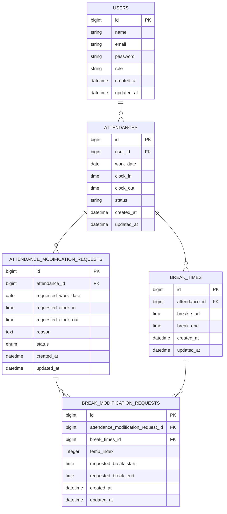

# coachtech 勤怠管理アプリ

## 環境構築
**Dockerビルド**
1. `git clone git@github.com:hiroyuki92/time-attendance-management.git`
2. `cd time-attendance-management`     クローンしたディレクトリに移動する
3. DockerDesktopアプリを立ち上げる
4. `docker-compose up -d --build`

**Laravel環境構築**
1. `docker-compose exec php bash`
2. `composer install`
3. 「.env.example」ファイルをコピーして 「.env」ファイルに命名を変更。
```bash
cp .env.example .env
```
4. 「.env.testing.example」ファイルをコピーして 「.env.testing」ファイルに命名を変更。
```bash
cp .env.testing.example .env.testing
```
5. .envに以下の環境変数を追加
``` text
DB_CONNECTION=mysql
DB_HOST=mysql
DB_PORT=3306
DB_DATABASE=laravel_db
DB_USERNAME=laravel_user
DB_PASSWORD=laravel_pass
```
5. 各環境のアプリケーションキーを生成
``` bash
php artisan key:generate        # .env用
php artisan key:generate --env=testing  # .env.testing用
```

6. マイグレーションとシーディングの実行
``` bash
php artisan migrate --seed
```  
　実行すると以下の初期データが作成されます  
  - 管理者ユーザー  
	メールアドレス: admin@example.com  
	パスワード: password  
	権限: 管理者  
  - 一般ユーザー  
	メールアドレス: user@example.com  
	パスワード: password  
	権限: 一般ユーザー  
  - ランダムな一般ユーザー  
	ダミーユーザーが10人生成されます。  
	メールアドレスや名前はランダムに設定されています。  
	パスワード: password  

7. メール認証機能の設定  
    #### 機能概要
	このアプリケーションには、ユーザー登録時にメールアドレスを確認するためのメール認証機能が実装されています。この機能により、不正なアカウント作成を防ぎ、アプリケーションのセキュリティを向上させます。

    #### 開発環境でのメール確認方法
	このプロジェクトでは、開発環境でのメール確認にMailHogを使用します。以下の手順でセットアップを行ってください。

	1. MailHogをインストールします。
   		- **macOSの場合**:
     		```bash
     		brew install mailhog
     		```
  	 	- **Linuxの場合**:
     		公式リリースページからバイナリをダウンロードしてください。
     		[https://github.com/mailhog/MailHog/releases](https://github.com/mailhog/MailHog/releases)
   		- **Windowsの場合**:
     		公式ページからバイナリをダウンロードして実行します。

	2. MailHogを起動します。
   		```bash
   		mailhog

	- **デフォルトポート**: `1025`
	- **Web UI**: [http://localhost:8025](http://localhost:8025)  
	送信されたメールはMailHogのWeb UI (http://localhost:8025) で確認できます。

   
11. テストの実行
``` bash
php artisan test
```

## 使用技術(実行環境)
- PHP8.3.0
- Laravel8.83.27
- MySQL8.0.26
- nginx 1.21.1
- MailHog（開発環境でのメール送信テスト用）

## ER図

